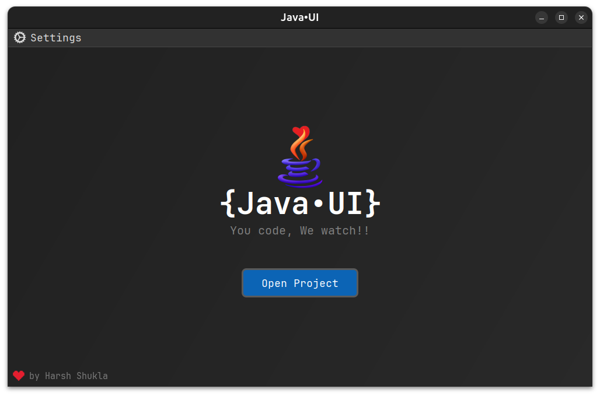
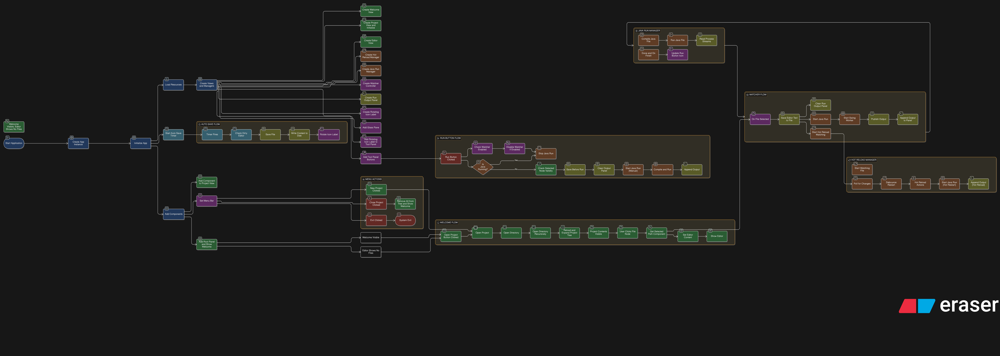

# JavaUI


A minimalistic code editor built using Java swing, flatlaf and RSyntaxTextArea.
This project is meant for learning and experimental purposes, by no means this is a production-ready code editor, but rather a fun attempt to learn and create my own code editor

<p align="center">
  
  
  
</p>
# The Problem and solution

When developing GUI applications in Java, every minor change required a full recompile and restart of the program. Iterating on the user interface became a tedious cycle of build, launch, test, tweak and repeat. This project addresses that pain by providing a lightweight Swing-based code editor with hot‑reload capability, letting you see UI changes instantly and greatly speeding up development.

# Features

- Syntax highlighting
- Auto save
- Adding, deleting or renaming files
- Open native terminal
- Language support for Java - AWT, SWING (more to be added soon)
- Dark theme
- Hot reload of UI changes

# UI Blocks explaination



# Directory structure

```
JavaUI
├─ DOCUMENTATION.md
├─ README.md
├─ pom.xml
└─ src
   └─ main
      ├─ java
      │  ├─ App.java
      │  ├─ CustomNode.java
      │  ├─ EditorView.java
      │  ├─ HotReloadManager.java
      │  ├─ JavaRunManager.java
      │  ├─ PassThroughGlassPane.java
      │  ├─ ProjectView.java
      │  ├─ RotatingIconLabel.java
      │  ├─ RunOutputPanel.java
      │  ├─ WatcherController.java
      │  └─ WelcomeView.java
      └─ resources
         ├─ META-INF
         │  └─ MANIFEST.MF
         ├─ icons
         │  ├─ bw-logo.png
         │  ├─ classIcon.png
         │  ├─ defaultIcon.png
         │  ├─ eyeClose.png
         │  ├─ eyeOpen.png
         │  ├─ folder_icon_24.png
         │  ├─ heart.png
         │  ├─ javaIcon.png
         │  ├─ logo.png
         │  ├─ pauseIcon.png
         │  ├─ playIcon.png
         │  ├─ refreshIcon.png
         │  ├─ settingIcon.png
         │  └─ terminalIcon.png
         └─ themes
            └─ monokai.xml

```
